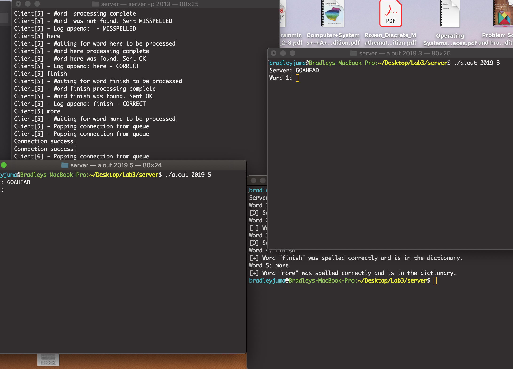
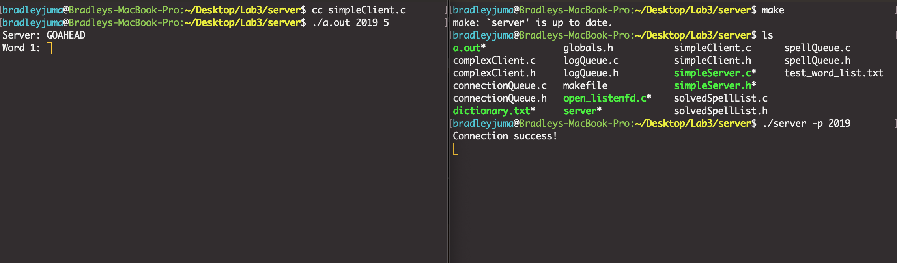

# Network-SpellChecker

> 


 Succesful connection

## Usage example
```shh
MyNetworkSpellChecker is also capable of taking in commands from a custom dictionary. 
The file contains numerous commands which are then Deli-mated by a new line in order to be executed. 
You may run a batch command on my server by easily setting it as your argument as shown above.

XCode IDE/ Terminal - gcc

makefile 
```
## Meta
```shh

Bradley Juma – 

bradleyjuma@me.com

(https://github.com/bradleyjuma)

```

## Contributing
```shh

1. Create your feature branch (`git checkout -b feature/fooBar`)
2. Commit your changes (`git commit -am 'Add some fooBar'`)
3. Push to the branch (`git push origin feature/fooBar`)
4. Create a new Pull Request

```

NETWORK-SPELLCHECKER
